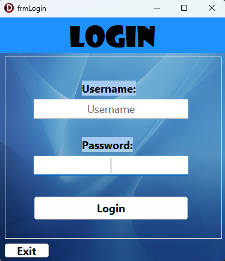
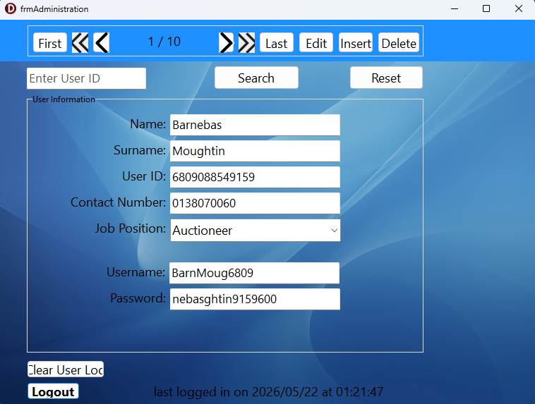
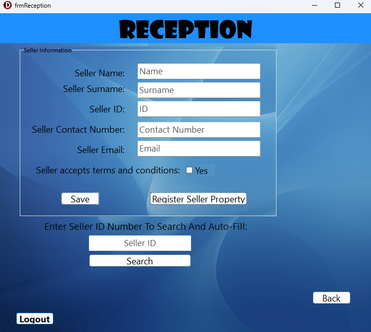
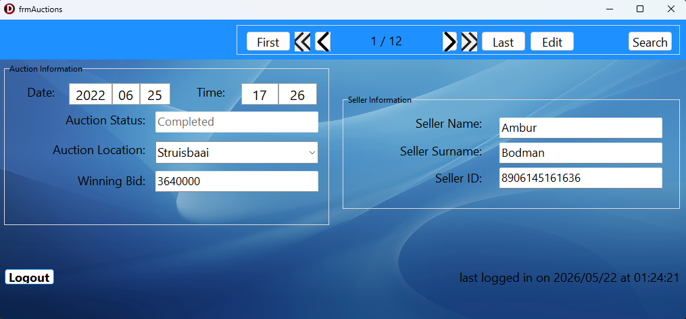
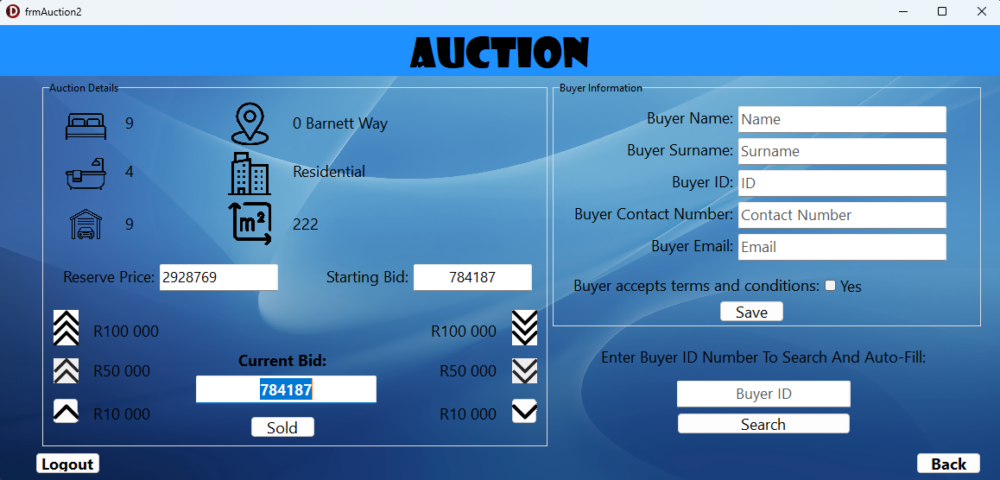
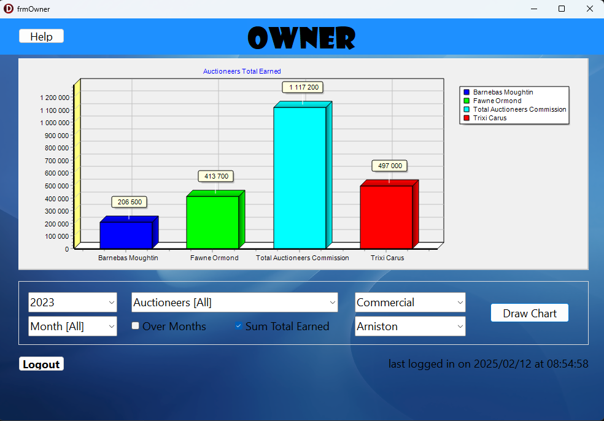

# Southern Auctioneers Management System

A robust, role-based desktop database application designed for **Southern Auctioneers** (Western Cape) to seamlessly coordinate real estate assets, client portfolios, live bidding operations, and financial performance metrics. 

This system was engineered using **Delphi (Object Pascal)** and interfaces with a relational **MS Access database** engine via **ActiveX Data Objects (ADO) and SQL**. It implements strict data validation boundaries, clear separation of concerns, and an automated analytics plotting dashboard.

---

## Business Case & Project Context

In real estate auctioneering, data fragmentation between property listings, separate buyer/seller registrations, and active event bidding streams can bottleneck operations. This application provides a unified digital solution mapping specific operational flows across four unique user roles:

* **Administrators:** Manage global system users, configure authentication parameters, and maintain security logs (`UsersLog.txt`) capturing runtime program execution footprints.
* **Receptionists:** Coordinate the primary data intake pipeline, dynamically validating South African IDs, cell numbers, and property dimensions ($m^2$) before registering them to the relational backend.
* **Auctioneers:** Execute live, transactional event panels. The system enforces logical constraint boundaries, ensuring active bids never fall below the starting reserve price or step outside configured bid increment thresholds.
* **Business Owners:** Access an analytical reporting terminal that dynamically aggregates performance metrics (computing the company's 7% commission rates across individual auctioneers) and visualizes the results on a charting axis.

---

## Tech Stack & Architecture

* **Language:** Delphi (Object Pascal)
* **Framework:** VCL (Visual Component Library)
* **Database Backend:** MS Access / Jet OLEDB Engine
* **Data Access Layer:** ADO (`TADOConnection`, `TADOTable`, `TADOQuery`) & Relational SQL
* **Analytics Engine:** TeeChart Pro / `TDBChart`
* **Data Synthesis:** Mockaroo (utilized for generating randomized relational mock data to rigorously test database query constraints)

### Architectural Flow
The application prevents "spaghetti code" structures by enforcing structural modularity:
1.  **Presentation Layer (UI):** Isolated form controllers (e.g., `uLogin`, `uAuctions`, `uOwner`) that manage UI states and capture user input.
2.  **Domain/Object Layer:** Custom Object-Oriented classes (e.g., `Users_u.pas`) utilizing full encapsulation (private variables, explicit constructors, and public getter/setter accessors) to track runtime user data.
3.  **Data Engine Layer (`dmPAT_DB_U.pas`):** A centralized Data Module acting as the single source of truth for database connections, table streams, and multi-channel transactional SQL streams (`qryA`, `qryB`, `qryC`).

---

## Core Code Showcase: Dynamic SQL Query Splicing

A primary technical highlight of this system is the business intelligence engine found inside `uOwner.pas`. To allow the business owner to filter metrics across a shifting combination of interactive controls, the system dynamically parses form element indexes into reusable SQL fragments:

```delphi
function TfrmOwner.NoOverMonths_NoTotals: string;
begin
  result := 'SELECT (tblUsers.Users_Name & " " & tblUsers.Users_Surname) AS Full_Name, SUM(tblAuctions.Winning_Bid * 7/100) AS TotalEarned '
    + 'FROM tblUsers, tblAuctions, tblProperties ' 
    + 'WHERE tblAuctions.Auctioneer_ID = tblUsers.Users_ID AND tblAuctions.Auction_ID = tblProperties.Auction_Event_ID AND tblUsers.Job_Position = "Auctioneer"'
    + AuctioneerSQL + YearSQL + MonthSQL + LocationSQL + PropertyTypeSQL +
    ' GROUP BY (tblUsers.Users_Name & " " & tblUsers.Users_Surname) ORDER BY (tblUsers.Users_Name & " " & tblUsers.Users_Surname) ASC;';
end;
```
---

## Application Showcase & Screenshots

### 1. Unified Access Portal (Role-Based Authentication)
Provides clean validation check gateways across unique user tiers to secure underlying operational tables.



---

### 2. User Administration Terminal
Allows full CRUD manipulation of system accounts, job positions, and security credentials over active relational table states.



---

### 3. Client & Property Intake Management
Coordinates rapid data intake validation boundaries for new sellers, properties, and verification records.



---

### 4. Auctioneer Pre-Flight Control Panel & Sales Ledger
Serves as the operational launchpad for live events. Auctioneers use this interface to query the property registry, assign an active asset to a live bidding session, and review or edit their personal historical sales log ledger.



---

### 5. Live Transactional Bidding Screen
Handles rapid increment alterations, buyer profiles, and real-time reserve-price threshold validations during live property events.



---

### 6. Business Intelligence Analytics Dashboard
Dynamically captures variable form control matrices, executes back-end relational SQL aggregate summaries, and renders real-time tracking metrics directly onto a 3D graphical axis.




---

## How to Run the Application (Executable Release)

Because this is a compiled desktop application, you do not need Delphi or RAD Studio installed to review its functionality. You can run the program natively on Windows using the pre-compiled binary.

### Prerequisites
* **Operating System:** Windows 10 or Windows 11
* **Database Driver:** Microsoft Access Database Engine (usually pre-installed on Windows machines with Microsoft Office).

### Execution Steps
1. **Download the Repository:** Clone or download this project folder as a `.zip` file to your local machine and extract it.
2. **Locate the Binary:** Navigate into the deployment folder where the executable is hosted.
3. **Run the App:** Double-click on `SouthernAuctioneers.exe`.
4. **Test Credentials:** You can log in using any of the simulated profiles found inside your initialization database. For example:

   * **Username:** `IdetLock4507`
   * **Password:** `dettekwood6496178`
   * **Role Permissions:** Administrator

   * **Username:** `InglTrim8603`
   * **Password:** `ebertmmell2452574`
   * **Role Permissions:** Auctioneer

   * **Username:** `JillWhit7105`
   * **Password:** `layneitter7558888`
   * **Role Permissions:** Owner

   * **Username:** `ElorPemb7909`
   * **Password:** `Eloraerton4184806`
   * **Role Permissions:** Reception

*Note: Ensure the MS Access database file (`.mdb`) remains in the exact same directory relative to the `.exe` file so the centralized Data Module (`dmPAT_DB_U.pas`) can establish its local ADO connection.*

## Developer Evaluation & Licensing
This repository was developed as part of a high-tier Information Technology Practical Assessment Task (PAT).

* **Final Evaluation Grade: 100%**
* **License: Distributed under the MIT License. See LICENSE for details.**